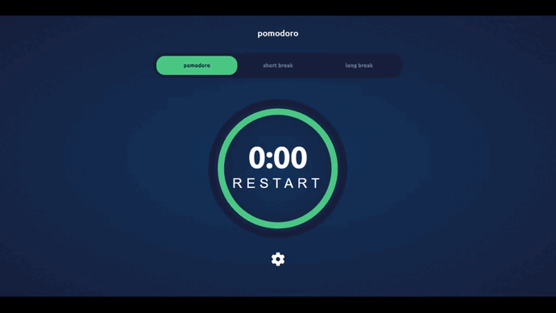

# Pomodoro-APP

Esta é minha versão para um pomodoro-APP baseada no design do desafio pomodoro-APP do front-end Mentor.

## Table of contents

- [Visão Geral](#Visão-Geral)
  - [O desafio](#O-desafio)
  - [Screenshot](#screenshot)
  - [Links](#links)
- [Meu processo](#Meu-processo)
  - [Construi com](#Construi-com)
  - [O que eu aprendi](#O-que-eu-aprendi)
  - [Desenvolvimento contínuo](#Desenvolvimento-contínuo)
- [Autor](#Autor)

## Visão-Geral

### O-desafio

Os usuários devem ser capazes de:

- Ver o layout ideal do app, dependendo do tamanho da tela do dispositivo.
- Escolher entre três fontes e cores para o timer
- Definir seu tempo de foco e descanso
- Alternar entre os timers
- Iniciar e pausar o timer quando necessário

### Screenshot



### Links

- Solution URL: [](https://github.com/AleexGarcia/Pomodoro-APP)
- Live Site URL: [](pomodoro-app-orcin-sigma.vercel.app)

## Meu-processo

### Construi-com

- Semantic HTML5 markup
- SCSS
- Flexbox
- CSS Grid
- Mobile-first workflow
- Javascript


### O-que-eu-aprendi

Aprendi a fazer uma barra de progresso circular utilizando SVG e CSS e como criar um cronometro com JS.


```css
 
```
```js

```

### Desenvolvimento-contínuo

Pretendo continuar aperfeiçoando meus conhecimentos em HTML, CSS E JS. Além de estudar mais sobre a area de front-end e melhorar cada vez mais. A proxima etapa um vez que esteja confortavel com esses assuntos seria consumir o maximo de conteudo sobre REACT com typeScript;


## Autor

- Frontend Mentor - [@AleexGarcia](https://www.frontendmentor.io/profile/AleexGarcia)
- Linkedin - [AleexGarcia](https://www.linkedin.com/in/aleexGarcia/)
